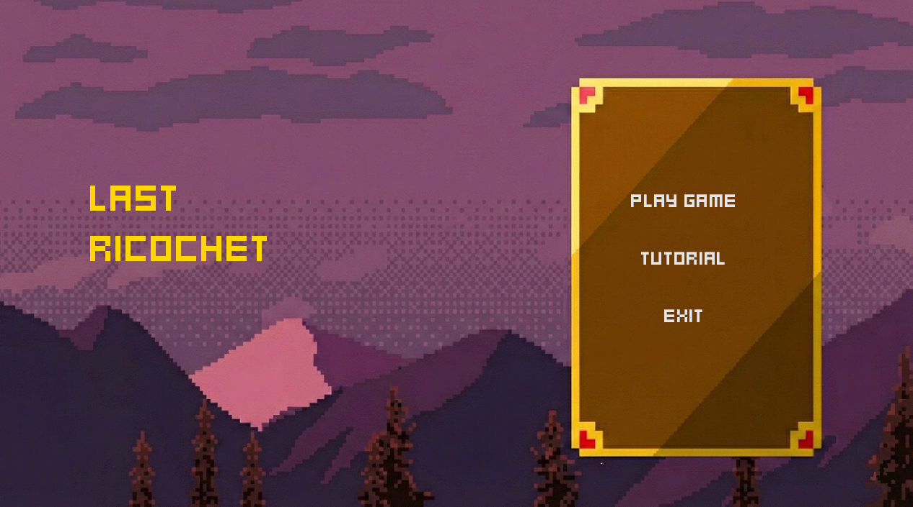
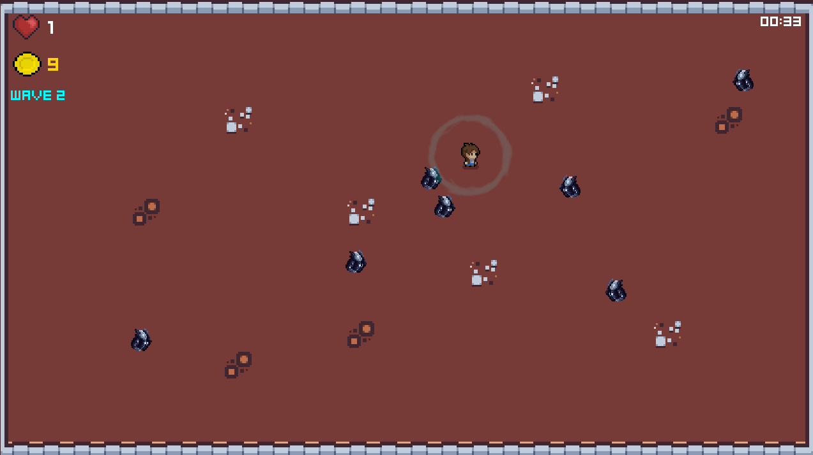
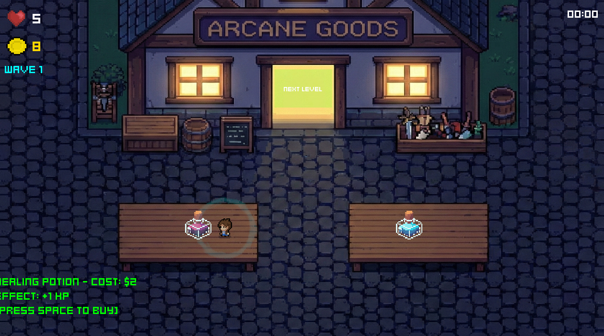

# Last Ricochet

Một project viết bằng **Rust** (100%) trong repo `nxhoang09/last_ricochet`.

## Visuals

> Một vài hình ảnh minh hoạ trong game:

<p align="center">
  
</p>

<p align="center">
  
</p>

<p align="center">
  
</p>

---

## Yêu cầu
- Rust (khuyến nghị cài bằng `rustup`)
- Cargo (đi kèm khi cài Rust)

Kiểm tra nhanh:
```bash
rustc --version
cargo --version
```

## Cài đặt
Clone repo:
```bash
git clone https://github.com/nxhoang09/last_ricochet.git
cd last_ricochet
```

Cài dependencies và build:
```bash
cargo build
```

## Chạy project
Chạy ở chế độ development:
```bash
cargo run
```

Chạy bản release (tối ưu hiệu năng):
```bash
cargo run --release
```

## Test
Chạy toàn bộ tests:
```bash
cargo test
```
